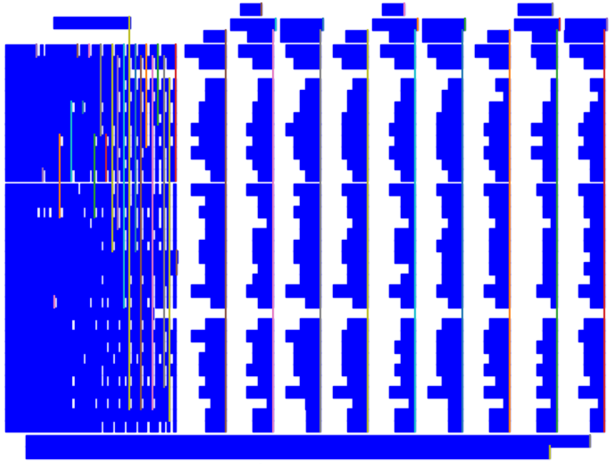
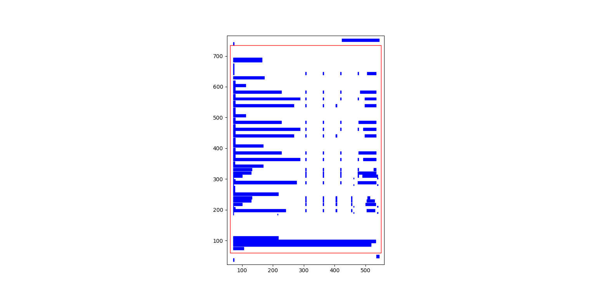

This page covers some of the more advanced configurations for [Lattice](how-it-works.md#lattice) and [Stream](how-it-works.md#stream).

## Process background lines

To detect line segments, [Lattice](how-it-works.md#lattice) needs the lines that make the table to be in the foreground. Here's an example of a table with lines in the background:

<figure markdown>
  
  <figcaption>A table with lines in background</figcaption>
</figure>

Source: [PDF](../pdf/background_lines.pdf)

To process background lines, you can pass `process_background=True`.

``` py
tables = camelot.read_pdf('background_lines.pdf', process_background=True)
tables[1].df
```

!!! tip
    Here's how you can do the same with the [command-line interface](cli.md).

    ``` bash
    $ camelot lattice -back background_lines.pdf
    ```

    {{ read_csv('background_lines.csv') }}

## Visual debugging

!!! note
    Visual debugging using `plot()` requires [matplotlib](https://matplotlib.org) which is an optional dependency. You can install it using `$ pip install camelot-py[plot]`.

You can use the [plot()](../api.md/#camelot.core.plotting.PlotMethods) method to generate a `matplotlib <https://matplotlib.org/>`_ plot of various elements that were detected on the PDF page while processing it. This can help you select table areas, column separators and debug bad table outputs, by tweaking different configuration parameters.

You can specify the type of element you want to plot using the `kind` keyword argument. The generated plot can be saved to a file by passing a `filename` keyword argument. The following plot types are supported:

- 'text'
- 'grid'
- 'contour'
- 'line'
- 'joint'
- 'textedge'

!!! note
    'line' and 'joint' can only be used with [Lattice](how-it-works.md#lattice) and 'textedge' can only be used with [Stream](how-it-works.md#stream).

Let's generate a plot for each type using this [PDF](../pdf/foo.pdf) as an example. First, let's get all the tables out.

``` py
>>> tables = camelot.read_pdf('foo.pdf')
>>> tables
<TableList n=1>
```

### text

Let's plot all the text present on the table's PDF page.

``` python
>>> camelot.plot(tables[0], kind='text').show()
```

!!! tip
    Here's how you can do the same with the [command-line interface](cli.md).

    ``` bash
    $ camelot lattice -plot text foo.pdf
    ```

<figure markdown>
  
  <figcaption>A plot of all text on a PDF page</figcaption>
</figure>

This, as we shall later see, is very helpful with [Stream](how-it-works.md/#stream) for noting table areas and column separators, in case Stream does not guess them correctly.

!!! note
    The *x-y* coordinates shown above change as you move your mouse cursor on the image, which can help you note coordinates.

### table

Let's plot the table (to see if it was detected correctly or not). This plot type, along with contour, line and joint is useful for debugging and improving the extraction output, in case the table wasn't detected correctly. (More on that later.)

``` python
>>> camelot.plot(tables[0], kind='grid').show()
```

!!! tip
    Here's how you can do the same with the [command-line interface](cli.md).

    ``` bash
    $ camelot lattice -plot grid foo.pdf
    ```

<figure markdown>
  
  <figcaption>A plot of all tables on a PDF page</figcaption>
</figure>

The table is perfect!

### contour

Now, let's plot all table boundaries present on the table's PDF page.

``` python
>>> camelot.plot(tables[0], kind='contour').show()
```

!!! tip
    Here's how you can do the same with the [command-line interface](cli.md).

    ``` bash
        $ camelot lattice -plot contour foo.pdf
    ```

<figure markdown>
  
  <figcaption>A plot of all contours on a PDF page</figcaption>
</figure>

### line

Cool, let's plot all line segments present on the table's PDF page.

``` python
>>> camelot.plot(tables[0], kind='line').show()
```

!!! tip
    Here's how you can do the same with the [command-line interface](cli.md).

    ``` bash
        $ camelot lattice -plot line foo.pdf
    ```

<figure markdown>
  
  <figcaption>A plot of all lines on a PDF page</figcaption>
</figure>

### joint

Finally, let's plot all line intersections present on the table's PDF page.

``` python
>>> camelot.plot(tables[0], kind='joint').show()
```

!!! tip
    Here's how you can do the same with the [command-line interface](cli.md).

    ``` bash
    $ camelot lattice -plot joint foo.pdf
    ```

<figure markdown>
  
  <figcaption>A plot of all line intersections on a PDF page</figcaption>
</figure>

### textedge

You can also visualize the textedges found on a page by specifying `kind='textedge'`. To know more about what a "textedge" is, you can see pages 20, 35 and 40 of [Anssi Nurminen's master's thesis](https://trepo.tuni.fi/bitstream/handle/123456789/21520/Nurminen.pdf).

``` python
>>> camelot.plot(tables[0], kind='textedge').show()
```

!!! tip
    Here's how you can do the same with the [command-line interface](cli.md).

    ``` bash
    $ camelot stream -plot textedge foo.pdf
    ```

<figure markdown>
  
  <figcaption>A plot of relevant textedges on a PDF page</figcaption>
</figure>

## Specify table areas

In cases such as [these](../pdf/table_areas.pdf), it can be useful to specify exact table boundaries. You can plot the text on this page and note the top left and bottom right coordinates of the table.

Table areas that you want Camelot to analyze can be passed as a list of comma-separated strings to :meth:`read_pdf() <camelot.read_pdf>`, using the `table_areas` keyword argument.

``` python
>>> tables = camelot.read_pdf('table_areas.pdf', flavor='stream', table_areas=['316,499,566,337'])
>>> tables[0].df
```

!!! tip
    Here's how you can do the same with the [command-line interface](cli.md).

    ``` bash
    $ camelot stream -T 316,499,566,337 table_areas.pdf
    ```

{{ read_csv('table_areas.csv') }}

!!! note
    `table_areas` accepts strings of the form x1,y1,x2,y2 where (x1, y1) -> top-left and (x2, y2) -> bottom-right in PDF coordinate space. In PDF coordinate space, the bottom-left corner of the page is the origin, with coordinates (0, 0).

## Specify table regions

However there may be cases like [1](../pdf/table_regions.pdf) and [2](https://github.com/camelot-dev/camelot/blob/master/tests/files/tableception.pdf), where the table might not lie at the exact coordinates every time but in an approximate region.

You can use the `table_regions` keyword argument to [read_pdf()](../api.md/#camelot.io.read_pdf) to solve for such cases. When `table_regions` is specified, Camelot will only analyze the specified regions to look for tables.

```python
>>> tables = camelot.read_pdf('table_regions.pdf', table_regions=['170,370,560,270'])
>>> tables[0].df
```

!!! tip
    Here's how you can do the same with the [command-line interface](cli.md).

    ``` bash
    $ camelot lattice -R 170,370,560,270 table_regions.pdf
    ```

{{ read_csv('table_regions.csv') }}

## Specify column separators

In cases like [these](../pdf/column_separators.pdf), where the text is very close to each other, it is possible that Camelot may guess the column separators' coordinates incorrectly. To correct this, you can explicitly specify the *x* coordinate for each column separator by plotting the text on the page.

You can pass the column separators as a list of comma-separated strings to :meth:`read_pdf() <camelot.read_pdf>`, using the `columns` keyword argument.

In case you passed a single column separators string list, and no table area is specified, the separators will be applied to the whole page. When a list of table areas is specified and you need to specify column separators as well, **the length of both lists should be equal**. Each table area will be mapped to each column separators' string using their indices.

For example, if you have specified two table areas, `table_areas=['12,54,43,23', '20,67,55,33']`, and only want to specify column separators for the first table, you can pass an empty string for the second table in the column separators' list like this, `columns=['10,120,200,400', '']`.

Let's get back to the *x* coordinates we got from plotting the text that exists on this [PDF](../pdf/column_separators.pdf), and get the table out!


``` python
>>> tables = camelot.read_pdf('column_separators.pdf', flavor='stream', columns=['72,95,209,327,442,529,566,606,683'])
>>> tables[0].df
```

!!! tip
    Here's how you can do the same with the [command-line interface](cli.md).

    ``` bash
    $ camelot stream -C 72,95,209,327,442,529,566,606,683 column_separators.pdf
    ```


| ... | ... | ... | ... | ... | ... | ... | ... | ... | ... |
| --- | --- | --- | --- | --- | --- | --- | --- | --- | --- |
| LICENSE | | | | PREMISE | | | | | |
| NUMBER TYPE DBA NAME||| LICENSEE NAME |ADDRESS |CITY | ST | ZIP | PHONE NUMBER | EXPIRES |
| ... | ... | ... | ... | ... | ... | ... | ... | ... | ... |


Ah! Since [PDFMiner](https://euske.github.io/pdfminer/) merged the strings, "NUMBER", "TYPE" and "DBA NAME", all of them were assigned to the same cell. Let's see how we can fix this in the next section.

## Split text along separators

To deal with cases like the output from the previous section, you can pass `split_text=True` to :meth:`read_pdf() <camelot.read_pdf>`, which will split any strings that lie in different cells but have been assigned to a single cell (as a result of being merged together by [PDFMiner](https://euske.github.io/pdfminer/)).

``` python
>>> tables = camelot.read_pdf('column_separators.pdf', flavor='stream', columns=['72,95,209,327,442,529,566,606,683'], split_text=True)
>>> tables[0].df
```

!!! tip
    Here's how you can do the same with the [command-line interface](cli.md).

    ``` bash
    $ camelot -split stream -C 72,95,209,327,442,529,566,606,683 column_separators.pdf
    ```

| ... | ... | ... | ... | ... | ... | ... | ... | ... | ... |
| --- | --- | --- | --- | --- | --- | --- | --- | --- | --- |
| LICENSE | | | | PREMISE | | | | | |
| NUMBER | TYPE | DBA NAME | LICENSEE NAME | ADDRESS | CITY | ST | ZIP | PHONE NUMBER | EXPIRES |
| ... | ... | ... | ... | ... | ... | ... | ... | ... | ... |

## Flag superscripts and subscripts

There might be cases where you want to differentiate between the text and superscripts or subscripts, like this [PDF](../pdf/superscript.pdf).

<figure markdown>
  
  <figcaption>A PDF with superscripts</figcaption>
</figure>

In this case, the text that [other tools](https://github.com/camelot-dev/camelot/wiki/Comparison-with-other-PDF-Table-Extraction-libraries-and-tools) return, will be `24.912`. This is relatively harmless when that decimal point is involved. But when it isn't there, you'll be left wondering why the results of your data analysis are 10x bigger!

You can solve this by passing `flag_size=True`, which will enclose the superscripts and subscripts with `<s></s>`, based on font size, as shown below.

```python
>>> tables = camelot.read_pdf('superscript.pdf', flavor='stream', flag_size=True)
>>> tables[0].df
```

!!! tip
    Here's how you can do the same with the [command-line interface](cli.md).

    ``` bash
    $ camelot -flag stream superscript.pdf
    ```

| ... | ... | ... | ... | ... | ... | ... | ... | ... | ... | ... |
| --- | --- | --- | --- | --- | --- | --- | --- | --- | --- | --- |
|Karnataka|22.44|19.59|-|-|2.86|1.22|-|0.89|-|0.69|
|Kerala|29.03|24.91^2^|-|-|4.11|1.77|-|0.48|-|1.45|
|Madhya Pradesh|27.13|23.57|-|-|3.56|0.38|-|1.86|-|1.28|
| ... | ... | ... | ... | ... | ... | ... | ... | ... | ... | ... |

## Strip characters from text

You can strip unwanted characters like spaces, dots and newlines from a string using the `strip_text` keyword argument. Take a look at `this PDF <https://github.com/camelot-dev/camelot/blob/master/tests/files/tabula/12s0324.pdf>`_ as an example, the text at the start of each row contains a lot of unwanted spaces, dots and newlines.

``` python
>>> tables = camelot.read_pdf('12s0324.pdf', flavor='stream', strip_text=' .\n')
>>> tables[0].df
```

!!! tip
    Here's how you can do the same with the [command-line interface](cli.md).

    ``` bash
    $ camelot -strip ' .\n' stream 12s0324.pdf
    ```

| ... | ... | ... | ... | ... | ... | ... | ... | ... | ... |
| --- | --- | --- | --- | --- | --- | --- | --- | --- | --- |
| Forcible rape | 17.5 | 2.6 | 14.9 | 17.2 | 2.5 | 14.7 | – | – | – |
| Robbery | 102.1 | 25.5 | 76.6 | 90.0 | 22.9 | 67.1 | 12.1 | 2.5 | 9.5 |
| Aggravated assault | 338.4 | 40.1 | 298.3 | 264.0 | 30.2 | 233.8 | 74.4 | 9.9 | 64.5 |
| Property crime | 1,396 .4 | 338 .7 | 1,057 .7 | 875 .9 | 210 .8 | 665 .1 | 608 .2 | 127 .9 | 392 .6 |
| Burglary | 240.9 | 60.3 | 180.6 | 205.0 | 53.4 | 151.7 | 35.9 | 6.9 | 29.0 |
| ... | ... | ... | ... | ... | ... | ... | ... | ... | ... |

## Improve guessed table areas


While using [Stream](how-it-works.md#stream), automatic table detection can fail for PDFs like [this one](https://github.com/camelot-dev/camelot/blob/master/tests/files/edge_tol.pdf). That's because the text is relatively far apart vertically, which can lead to shorter textedges being calculated.

!!! note
    To know more about how textedges are calculated to guess table areas, you can see pages 20, 35 and 40 of [Anssi Nurminen's master's thesis](https://trepo.tuni.fi/bitstream/handle/123456789/21520/Nurminen.pdf?sequence=3).

Let's see the table area that is detected by default.

``` python
>>> tables = camelot.read_pdf('edge_tol.pdf', flavor='stream')
>>> camelot.plot(tables[0], kind='contour').show()
```

!!! tip
    Here's how you can do the same with the [command-line interface](cli.md).

    ``` bash
    $ camelot stream -plot contour edge.pdf
    ```

<figure markdown>
  
  <figcaption>Table area with default edge_tol</figcaption>
</figure >

To improve the detected area, you can increase the `edge_tol` (default: 50) value to counter the effect of text being placed relatively far apart vertically. Larger `edge_tol` will lead to longer textedges being detected, leading to an improved guess of the table area. Let's use a value of 500.

``` python
>>> tables = camelot.read_pdf('edge_tol.pdf', flavor='stream', edge_tol=500)
>>> camelot.plot(tables[0], kind='contour').show()
```

!!! tip
    Here's how you can do the same with the [command-line interface](cli.md).

    ``` bash
    $ camelot stream -e 500 -plot contour edge.pdf
    ```

<figure markdown>
  
  <figcaption>Table area with default edge_tol</figcaption>
</figure>

As you can see, the guessed table area has improved!

## Improve guessed table rows

You can pass `row_tol=<+int>` to group the rows closer together, as shown below.

``` python
>>> tables = camelot.read_pdf('group_rows.pdf', flavor='stream')
>>> tables[0].df
```

| Clave | | Clave | | | Clave | |
| --- | --- | --- | --- | --- | --- | --- |
|  | Nombre Entidad | | | Nombre Municipio | | Nombre Localidad |
| Entidad | | Municipio | | | Localidad | |
| 01 | Aguascalientes | 001 | Aguascalientes | | 0094 | Granja Adelita |
| 01 | Aguascalientes | 001 | Aguascalientes | | 0096 | Agua Azul |
| 01 | Aguascalientes | 001 | Aguascalientes | | 0100 | Rancho Alegre |

``` python
>>> tables = camelot.read_pdf('group_rows.pdf', flavor='stream', row_tol=10)
>>> tables[0].df
```

!!! tip
    Here's how you can do the same with the [command-line interface](cli.md).

    ``` bash
    $ camelot stream -r 10 group_rows.pdf
    ```

| Clave | Nombre Entidad | Clave | | Nombre Municipio | Clave | Nombre Localidad |
| --- | --- | --- | --- | --- | --- | --- |
| Entidad | | Municipio | | | Localidad | |
| 01 | Aguascalientes | 001 | Aguascalientes | | 0094 | Granja Adelita |
| 01 | Aguascalientes | 001 | Aguascalientes | | 0096 | Agua Azul |
| 01 | Aguascalientes | 001 | Aguascalientes | | 0100 | Rancho Alegre |

## Detect short lines

There might be cases while using [Lattice](how-it-works.md#lattice) when smaller lines don't get detected. The size of the smallest line that gets detected is calculated by dividing the PDF page's dimensions with a scaling factor called `line_scale`. By default, its value is 15.

As you can guess, the larger the `line_scale`, the smaller the size of lines getting detected.

.. warning:: Making `line_scale` very large (>150) will lead to text getting detected as lines.

Here's a [PDF](../pdf/short_lines.pdf) where small lines separating the the headers don't get detected with the default value of 15.

<figure markdown>
  { align=left }
  <figcaption>A PDF table with short lines</figcaption>
</figure>

Let's plot the table for this PDF.

``` python
>>> tables = camelot.read_pdf('short_lines.pdf')
>>> camelot.plot(tables[0], kind='grid').show()
```

<figure markdown>
  { align=left }
  <figcaption>A plot of the PDF table with short lines</figcaption>
</figure>

Clearly, the smaller lines separating the headers, couldn't be detected. Let's try with `line_scale=40`, and plot the table again.

``` python
>>> tables = camelot.read_pdf('short_lines.pdf', line_scale=40)
>>> camelot.plot(tables[0], kind='grid').show()
```

!!! tip
    Here's how you can do the same with the [command-line interface](cli.md).

    ``` bash
    $ camelot lattice -scale 40 -plot grid short_lines.pdf
    ```

{ align=left }
<figure markdown>
  { align=left }
  <figcaption>An improved plot of the PDF table with short lines</figcaption>
</figure>

Voila! Camelot can now see those lines. Let's get our table.

``` python
>>> tables[0].df
```

| Investigations | No. ofHHs | Age/Sex/Physiological  Group | Preva-lence | C.I* | RelativePrecision | Sample sizeper State|
| --- | --- | --- | --- | --- | --- | --- |
| Anthropometry | 2400 | All ... | | | | |
| Clinical Examination | | | | | | |
| History of morbidity | | | | | | |
| Diet survey | 1200 | All ... | | | | |
| Blood Pressure # | 2400 | Men (≥ 18yrs) | 10% | 95% | 20% | 1728 |
| | | Women (≥ 18 yrs) | | | | 1728 |
| Fasting blood glucose | 2400 | Men (≥ 18 yrs) | 5% | 95% | 20% | 1825 |
| | | Women (≥ 18 yrs) | | | | 1825 |
| Knowledge &Practices on HTN &DM | 2400 | Men (≥ 18 yrs) | - | - | - | 1728 |
| | 2400 | Women (≥ 18 yrs) | - | - | - | 1728 |

## Shift text in spanning cells

By default, the [Lattice](how-it-works.md#lattice) method shifts text in spanning cells, first to the left and then to the top, as you can observe in the output table above. However, this behavior can be changed using the `shift_text` keyword argument. Think of it as setting the *gravity* for a table — it decides the direction in which the text will move and finally come to rest.

`shift_text` expects a list with one or more characters from the following set: `('', l', 'r', 't', 'b')`, which are then applied *in order*. The default, as we discussed above, is `['l', 't']`.

We'll use the [PDF](../pdf/short_lines.pdf) from the previous example. Let's pass `shift_text=['']`, which basically means that the text will experience weightlessness! (It will remain in place.)

<figure markdown>
  { align=left  }
  <figcaption>A PDF table with short lines</figcaption>
</figure>

``` python
>>> tables = camelot.read_pdf('short_lines.pdf', line_scale=40, shift_text=[''])
>>> tables[0].df
```

| Investigations | No. ofHHs | Age/Sex/Physiological  Group | Preva-lence | C.I* | RelativePrecision | Sample sizeper State |
| --- | --- | --- | --- | --- | --- | --- |
| Anthropometry | | | | | | |
| Clinical Examination | 2400 | | All ... | | | |
| History of morbidity | | | | | | |
| Diet survey | 1200 | | All ... | | | |
| | | Men (≥ 18yrs) | | | | 1728 |
| Blood Pressure # | 2400 | Women (≥ 18 yrs) | 10% | 95% | 20% | 1728 |
| | | Men (≥ 18 yrs) | | | | 1825 |
| Fasting blood glucose | 2400 | Women (≥ 18 yrs) | 5% | 95% | 20% | 1825 |
| Knowledge &Practices on HTN & | 2400 | Men (≥ 18 yrs) | - | - | - | 1728 |
| DM | 2400 | Women (≥ 18 yrs) | - | - | - | 1728 |

No surprises there — it did remain in place (observe the strings "2400" and "All the available individuals"). Let's pass `shift_text=['r', 'b']` to set the *gravity* to right-bottom and move the text in that direction.

``` python
>>> tables = camelot.read_pdf('short_lines.pdf', line_scale=40, shift_text=['r', 'b'])
>>> tables[0].df
```

!!! tip
    Here's how you can do the same with the [command-line interface](cli.md).

    ``` bash
    $ camelot lattice -scale 40 -shift r -shift b short_lines.pdf
    ```

| Investigations | No. ofHHs | Age/Sex/Physiological  Group | Preva-lence | C.I* | RelativePrecision | Sample sizeper State |
| --- | --- | --- | --- | --- | --- | --- |
| Anthropometry | | | | | | |
| Clinical Examination | | | | | |  |
| History of morbidity | 2400 | | | | | All ... |
| Diet survey | 1200 | | | | | All ... |
| | | Men (≥ 18yrs) | | | | 1728 |
| Blood Pressure # | 2400 | Women (≥ 18 yrs) | 10% | 95% | 20% | 1728 |
| | | Men (≥ 18 yrs) | | | | 1825 |
| Fasting blood glucose | 2400 | Women (≥ 18 yrs) | 5% | 95% | 20% | 1825 |
| | 2400 | Men (≥ 18 yrs) | - | - | - | 1728 |
| Knowledge &Practices on HTN &DM | 2400 | Women (≥ 18 yrs) | - | - | - | 1728 |

## Copy text in spanning cells

You can copy text in spanning cells when using [Lattice](how-it-works.md#lattice), in either the horizontal or vertical direction, or both. This behavior is disabled by default.

`copy_text` expects a list with one or more characters from the following set: `('v', 'h')`, which are then applied *in order*.

Let's try it out on this [PDF](../pdf/copy_text.pdf). First, let's check out the output table to see if we need to use any other configuration parameters.

``` python
>>> tables = camelot.read_pdf('copy_text.pdf')
>>> tables[0].df
```

| Sl. No. | Name of State/UT | Name of District | Disease/ Illness | No. of Cases | No. of Deaths | Date of start of outbreak | Date of reporting | Current Status | ... |
| --- | --- | --- | --- | --- | --- | --- | --- | --- | --- |
| 1 | Kerala | Kollam | i.  Food Poisoning | 19 | 0 | 31/12/13 | 03/01/14 | Under control | ... |
| 2 | Maharashtra | Beed | i.  Dengue & Chikungunya   i | 11 | 0 | 03/01/14 | 04/01/14 | Under control | ... |
| 3 | Odisha | Kalahandi | iii. Food Poisoning | 42 | 0 | 02/01/14 | 03/01/14 | Under control | ... |
| 4 | West Bengal | West Medinipur | iv. Acute Diarrhoeal Disease | 145 | 0 | 04/01/14 | 05/01/14 | Under control | ... |
| | | Birbhum | v.  Food Poisoning | 199 | 0 | 31/12/13 | 31/12/13 | Under control | ... |
| | | Howrah | vi. Viral Hepatitis A &E | 85 | 0 | 26/12/13 | 27/12/13 | Under surveillance | ... |

We don't need anything else. Now, let's pass `copy_text=['v']` to copy text in the vertical direction. This can save you some time by not having to add this step in your cleaning script!

``` python
>>> tables = camelot.read_pdf('copy_text.pdf', copy_text=['v'])
>>> tables[0].df
```

!!! tip
    Here's how you can do the same with the [command-line interface](cli.md).

    ``` bash
    $ camelot lattice -copy v copy_text.pdf
    ```
    
| Sl. No. | Name of State/UT | Name of District | Disease/ Illness | No. of Cases | No. of Deaths | Date of start of outbreak | Date of reporting | Current Status | ... |
| --- | --- | --- | --- | --- | --- | --- | --- | --- | --- |
| 1 | Kerala | Kollam | i.  Food Poisoning | 19 | 0 | 31/12/13 | 03/01/14 | Under control | ... |
| 2 | Maharashtra | Beed | i.  Dengue & Chikungunya   i | 11 | 0 | 03/01/14 | 04/01/14 | Under control | ... |
| 3 | Odisha | Kalahandi | iii. Food Poisoning | 42 | 0 | 02/01/14 | 03/01/14 | Under control | ... |
| 4 | West Bengal | West Medinipur | iv. Acute Diarrhoeal Disease | 145 | 0 | 04/01/14 | 05/01/14 | Under control | ... |
| 4 | West Bengal | Birbhum | v.  Food Poisoning | 199 | 0 | 31/12/13 | 31/12/13 | Under control | ... |
| 4 | West Bengal | Howrah | vi. Viral Hepatitis A &E | 85 | 0 | 26/12/13 | 27/12/13 | Under surveillance | ... |

## Tweak layout generation

Camelot is built on top of PDFMiner's functionality of grouping characters on a page into words and sentences. In some cases (such as [#170](https://github.com/camelot-dev/camelot/issues/170) and [#215](https://github.com/camelot-dev/camelot/issues/215)), PDFMiner can group characters that should belong to the same sentence into separate sentences.

To deal with such cases, you can tweak PDFMiner's [LAParams kwargs](https://github.com/euske/pdfminer/blob/master/pdfminer/layout.py#L33) to improve layout generation, by passing the keyword arguments as a dict using `layout_kwargs` in [read_pdf()](../api.md/#camelot.io.read_pdf). To know more about the parameters you can tweak, you can check out [PDFMiner docs](https://pdfminersix.rtfd.io/en/latest/reference/composable.html).


``` python
    >>> tables = camelot.read_pdf('foo.pdf', layout_kwargs={'detect_vertical': False})
```

## Use alternate image conversion backends

When using the [Lattice](how-it-works.md#lattice) flavor, Camelot uses `ghostscript` to convert PDF pages to images for line recognition. If you face installation issues with `ghostscript`, you can use an alternate image conversion backend called `poppler`. You can specify which image conversion backend you want to use with::

``` py
>>> tables = camelot.read_pdf(filename, backend="ghostscript")  # default
>>> tables = camelot.read_pdf(filename, backend="poppler")
```
!!! note
    `ghostscript` will be replaced by `poppler` as the default image conversion backend in `v0.12.0`.

If you face issues with both `ghostscript` and `poppler`, you can supply your own image conversion backend:

``` python
>>> class ConversionBackend(object):
>>>     def convert(pdf_path, png_path):
>>>         # read pdf page from pdf_path
>>>         # convert pdf page to image
>>>         # write image to png_path
>>>         pass
>>>
>>> tables = camelot.read_pdf(filename, backend=ConversionBackend())
```