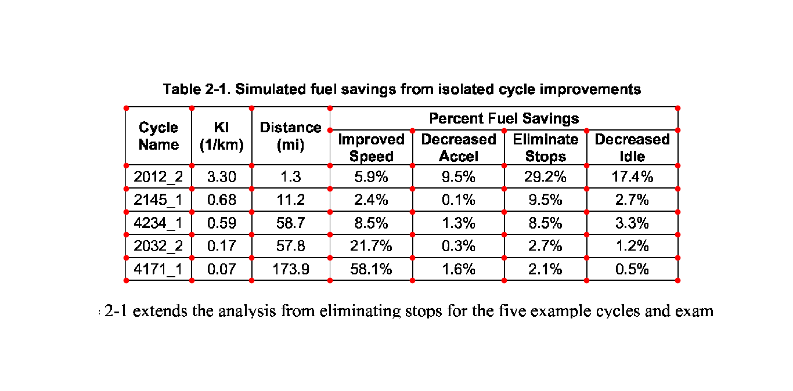
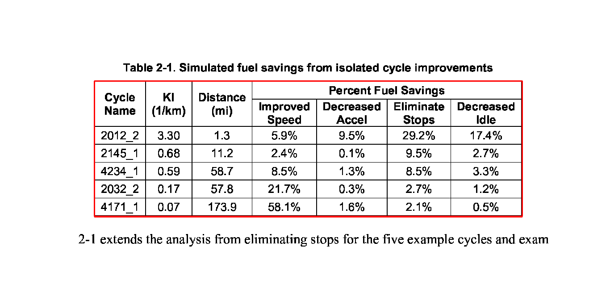
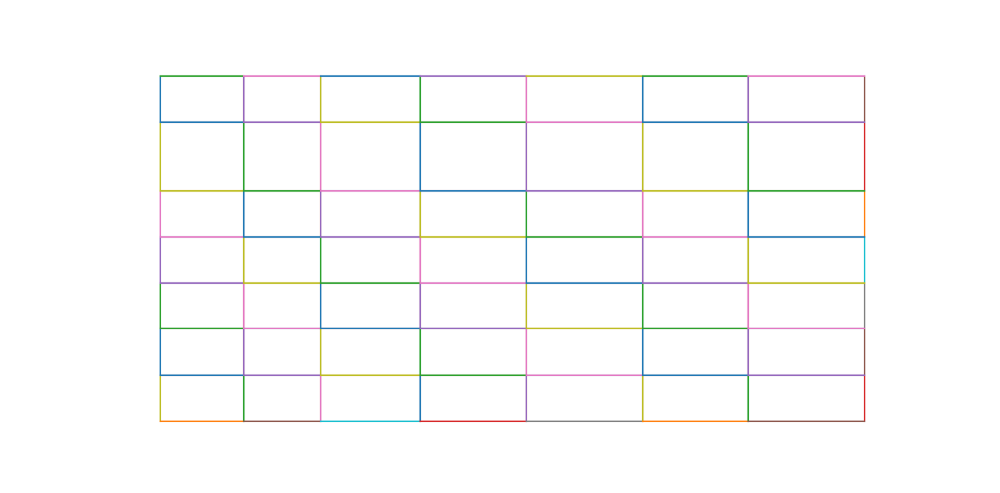

This part of the documentation includes a high-level explanation of how Camelot extracts tables from PDF files.

You can choose between two table parsing methods, *Stream* and *Lattice*. These names for parsing methods inside Camelot were inspired from [Tabula](https://github.com/tabulapdf/tabula).

## Stream

Stream can be used to parse tables that have whitespaces between cells to simulate a table structure. It is built on top of PDFMiner's functionality of grouping characters on a page into words and sentences, using [margins](https://euske.github.io/pdfminer/#tools).

1. Words on the PDF page are grouped into text rows based on their *y* axis overlaps.

2. Textedges are calculated and then used to guess interesting table areas on the PDF page. You can read [Anssi Nurminen's master's thesis](https://pdfs.semanticscholar.org/a9b1/67a86fb189bfcd366c3839f33f0404db9c10.pdf) to know more about this table detection technique. [See pages 20, 35 and 40]

3. The number of columns inside each table area are then guessed. This is done by calculating the mode of number of words in each text row. Based on this mode, words in each text row are chosen to calculate a list of column *x* ranges.

4. Words that lie inside/outside the current column *x* ranges are then used to extend the current list of columns.

5. Finally, a table is formed using the text rows' *y* ranges and column *x* ranges and words found on the page are assigned to the table's cells based on their *x* and *y* coordinates.

## Lattice

Lattice is more deterministic in nature, and it does not rely on guesses. It can be used to parse tables that have demarcated lines between cells, and it can automatically parse multiple tables present on a page.

It starts by converting the PDF page to an image using ghostscript, and then processes it to get horizontal and vertical line segments by applying a set of morphological transformations (erosion and dilation) using OpenCV.

Let's see how Lattice processes the second page of [this PDF](../pdf/us-030.pdf), step-by-step.

1. Line segments are detected.

2. Line intersections are detected, by overlapping the detected line segments and "[and](https://en.wikipedia.org/wiki/Logical_conjunction)"ing their pixel intensities.

3. Table boundaries are computed by overlapping the detected line segments again, this time by "[or](https://en.wikipedia.org/wiki/Logical_disjunction)"ing their pixel intensities.

4. Since dimensions of the PDF page and its image vary, the detected table boundaries, line intersections, and line segments are scaled and translated to the PDF page's coordinate space, and a representation of the table is created.

5. Spanning cells are detected using the line segments and line intersections.

6. Finally, the words found on the page are assigned to the table's cells based on their *x* and *y* coordinates.
